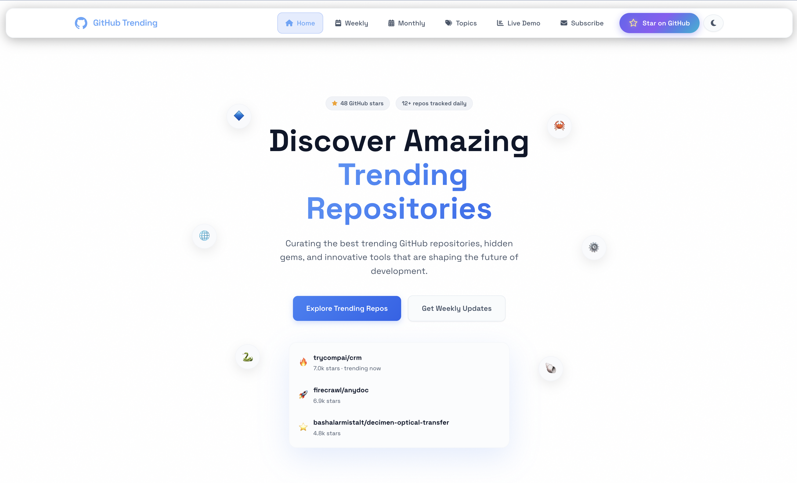

# GitHub 趋势

> 快速发现哪些仓库正在 GitHub 上获得关注——每日、每周、每月，以及 25 个精选主题——无需手动翻阅 GitHub 官方的趋势页面。

[](https://opensource.org/licenses/MIT)
[](https://nodejs.org/)
[](https://reactjs.org/)

**[在线演示](https://github.ranbot.online)** · **[报告问题](https://github.com/encoreshao/github-trending/issues)** · **[功能建议](https://github.com/encoreshao/github-trending/issues)**

[English](README.md) | [中文](README-zh.md)

---

<p align="center">
  
</p>

## 概述

GitHub Trending 帮助你快速发现哪些仓库正在获得关注——无论是今天、本周、本月，还是某个特定主题下——而无需手动翻阅 GitHub 官方的趋势页面。一个 CLI 脚本按计划任务（cron）定期抓取 GitHub 搜索 API 的快照，以带版本记录的 JSON/CSV 文件保存到 `docs/` 目录；一个 React Web 应用则将这些快照呈现为快速、可导出、支持双语的浏览体验，并覆盖 25 个精选主题页面，涵盖编程语言、框架，以及 Claude Code、Gemini、DeepSeek 等热门 AI 工具。

### 核心功能

| 功能 | 描述 |
|------|------|
| **实时数据** | 通过 GitHub API 实时获取热门仓库 |
| **双视图模式** | 表格视图用于数据分析，卡片视图用于可视化浏览 |
| **智能筛选** | 按分类、关键词和 20+ 属性进行筛选 |
| **周报 & 月报** | 按滚动周期刷新的精选 Top 20 页面，并展示周/月环比变化 |
| **主题页面** | 25 个精选主题（AI、React、DevOps、安全、Claude Code、Gemini、DeepSeek 等），每个主题都有每日刷新的独立趋势页面和快速主题切换器 |
| **个性化订阅** | 选择感兴趣的主题，直接提交到 Google 表格 |
| **跨页面探索** | 首页、周报、月报、主题、订阅和演示页通过主题化的预告板块相互链接，并以短渐变分隔线衔接 |
| **RanBOT 家族** | 跨站推广网格，链接到 8 个 RanBOT 兄弟产品，涵盖托管应用与开源爬虫工具 |
| **导出选项** | 下载为 CSV、JSON 或复制到剪贴板 |
| **深色主题** | 现代毛玻璃设计，流畅动画效果 |
| **双语支持** | 完整的英文和中文语言支持 |

---

## 快速开始

### 环境要求

- Node.js 16+
- GitHub 个人访问令牌（[点击获取](https://github.com/settings/tokens)）

### 安装

```bash
# 克隆仓库
git clone https://github.com/encoreshao/github-trending.git
cd github-trending

# 安装依赖
npm install

# 启动开发服务器
npm run dev
```

在浏览器中打开 [http://localhost:5173](http://localhost:5173)。

### 使用方法

1. 导航到 **实时演示**（`/demo`）
2. 在设置面板中输入您的 GitHub 令牌
3. 选择要显示的字段
4. 点击 **获取数据** 加载热门仓库
5. 在表格和卡片视图之间切换
6. 根据需要导出数据

---

## 页面

| 路由 | 描述 |
|------|------|
| `/` | 首页：每日热门仓库网格、周报/月报预告，以及 RanBOT 家族推广 |
| `/demo` | 交互式仓库分析工具，其后附带每日趋势、周报、月报预告 |
| `/weekly` | 最近 30 天内创建的 Top 20 仓库，每周一刷新 —— 交叉链接到月度精选和每日趋势 |
| `/monthly` | 最近 90 天内创建的 Top 20 仓库，每月 1 日刷新 —— 交叉链接到周度精选和订阅 CTA |
| `/topics` | 全部 25 个主题的索引页，每个主题链接到其专属页面 |
| `/topics/:slug` | 单个主题最近 7 天内创建的 Top 20 仓库 —— 页面顶部带主题切换器，并附带每日/每周/每月概览板块 |
| `/subscribe` | 基于主题的订阅设置，提交至 Google 表格，其后附带 RanBOT 家族推广 |
| `*` | 未匹配或被显式屏蔽路由的自定义 404 页面（见 `src/blockedRoutes.js`） |

每个页面会混合搭配 3-5 个板块，而不是在所有页面重复同样的内容 —— 完整的跨站推广列表见下方「RanBOT 大家族」章节。

---

## RanBOT 大家族

首页、订阅页和演示页会交叉推广更广泛的 RanBOT 产品家族：

| 产品 | 分类 | 描述 |
|------|------|------|
| [Skills](https://skills.ranbot.online/) | 效率工具 | 精选技能手册，助你更好地与 AI 协作 |
| [PPT](https://ppt.ranbot.online/) | 内容创作 | 几分钟内将想法转化为精美演示文稿 |
| [RSS](https://rss.ranbot.online/) | 内容创作 | 在一个信息流中关注你真正关心的信息源 |
| [Video](https://video.ranbot.online/) | 内容创作 | AI 辅助的视频创作与剪辑 |
| [Data Graph](https://data-graph.ranbot.online/) | 数据 | 可视化并探索关联数据 |
| [TikTok Scraper](https://github.com/ranbot-ai/tiktok-scraper) | 数据抓取 | 按需抓取 TikTok 热门视频和创作者数据 |
| [X Scraper](https://github.com/ranbot-ai/x-scraper) | 数据抓取 | 采集 X（Twitter）上的推文、话题串和主页数据 |
| [Product Hunt](https://github.com/ranbot-ai/product-hunt) | 发现 | 在产品爆火之前追踪每日新品 |

该列表定义在 `src/components/RanbotPromoSection.jsx` 中 —— 在其中新增一项（name、url、icon、category、blurb、features、gradient）即可推广新产品。

---

## 技术栈

- **前端：** React 18、Vite、Ant Design 5
- **样式：** CSS3 毛玻璃效果
- **接口：** GitHub REST API
- **数据：** axios、papaparse、file-saver

---

## 项目结构

```
src/
├── api/                 # GitHub API + Google 表格集成
├── data/
│   └── topics.js        # 25 个主题的唯一数据源（id/name/description/icon）
├── components/          # 可复用 UI 组件
│   ├── Header           # 导航栏
│   ├── Footer           # 页脚（含完整主题链接列表）
│   ├── RepoTable        # 表格视图组件
│   ├── RepoCard         # 卡片视图组件
│   ├── TrendingPeriodPage # 周报/月报/主题页面共用外壳
│   ├── TopicSwitcher         # 主题页面顶部的可滚动主题切换器
│   ├── PeriodOverviewSection # 周报/月报预告卡片（按周期呈现不同主题样式）
│   ├── DailyOverviewSection  # 每日趋势滚动条，链接回首页
│   ├── RanbotPromoSection    # "RanBOT 家族成员" 跨站推广网格
│   ├── SubscribeCtaBanner    # 精简版订阅行动号召横幅
│   ├── SectionDivider        # 首页风格板块之间的短渐变分隔线
│   └── Settings         # 配置面板
├── pages/               # 路由页面
│   ├── HomePage
│   ├── DemoPage
│   ├── WeeklyPage
│   ├── MonthlyPage
│   ├── TopicsIndexPage  # /topics —— 全部 25 个主题的网格索引
│   ├── TopicPage        # /topics/:slug —— 单个主题的趋势页面
│   ├── SubscriptionPage
│   └── NotFoundPage
├── blockedRoutes.js     # 需强制走 404 页面的路径
├── locales/             # 国际化翻译
└── utils/               # 工具函数
```

---

## CLI 脚本（可选）

用于自动化数据收集：

```bash
# 设置环境变量
echo "GITHUB_TOKEN=your_token" > .env

# 按周期运行脚本（默认 daily）
node index.js --period=daily
node index.js --period=weekly
node index.js --period=monthly

# 或使用 npm
npm run trending:daily
npm run trending:weekly
npm run trending:monthly
```

每个周期都会以该周期起始日期命名，保存一份 JSON + CSV 快照：

| 周期 | 输出路径 | 文件名 |
|------|----------|--------|
| `daily` | `docs/YYYY/MM/` | `YYYY-MM-DD`（今天） |
| `weekly` | `docs/weekly/YYYY/MM/` | `YYYY-MM-DD`（当前 ISO 周的周一） |
| `monthly` | `docs/monthly/YYYY/` | `YYYY-MM`（当前月） |

`daily` 任务还会为 `src/data/topics.js` 中的每个主题额外抓取一份快照（使用 GitHub 的 `topic:<slug>` 查询语法，最近 7 天内创建，按星标排序），保存至 `docs/topics/<slug>/YYYY/MM/YYYY-MM-DD.{json,csv}` —— 这正是 `/topics/:slug` 页面的数据来源。

### 使用 Cron 自动化

```bash
# 每天上午 9 点执行
0 9 * * * cd /path/to/github-trending && npm run trending:daily

# 每周一上午 9 点执行
0 9 * * 1 cd /path/to/github-trending && npm run trending:weekly

# 每月 1 日上午 9 点执行
0 9 1 * * cd /path/to/github-trending && npm run trending:monthly
```

`scripts/` 目录下也提供了对应周期的现成脚本（`run.sh`、`run-weekly.sh`、`run-monthly.sh`）。

---

## 配置

### Web 应用设置

设置自动保存在 localStorage 中：

- **GitHub 令牌** - 您的个人访问令牌（本地存储）
- **显示字段** - 从 20+ 个仓库属性中选择
- **每页数量** - 每页仓库数（1-100）
- **语言** - 英文或中文

### 订阅 → Google 表格

`/subscribe` 表单会将提交内容 POST 到 Google Apps Script Web App，并追加写入 Google 表格。请在 `.env` 中设置该 Webhook 地址：

```bash
VITE_GOOGLE_SHEETS_WEBHOOK_URL=https://script.google.com/macros/s/.../exec
```

Apps Script 的部署步骤见 `docs/subscribe-google-sheets-setup.md`（仅本地保留，未纳入 git 版本控制）。未设置该变量时，提交会明确报错，而不是静默失败。

### 可用字段

| 基本信息 | URL | 日期 | 统计 |
|----------|-----|------|------|
| 名称 | HTML URL | 创建时间 | 星标 |
| 所有者 | Git URL | 更新时间 | 分支 |
| 头像 | SSH URL | 推送时间 | 问题 |
| 描述 | Clone URL | | 大小 |
| 主题 | SVN URL | | 语言 |
| 许可证 | 主页 | | |

---

## 故障排除

| 问题 | 解决方案 |
|------|----------|
| **超出速率限制** | 确保 GitHub 令牌有效且具有 `public_repo` 权限 |
| **没有返回数据** | 验证令牌和网络连接 |
| **构建错误** | 运行 `rm -rf node_modules && npm install` |

---

## 贡献

1. Fork 仓库
2. 创建功能分支（`git checkout -b feature/amazing-feature`）
3. 提交更改（`git commit -m 'Add amazing feature'`）
4. 推送到分支（`git push origin feature/amazing-feature`）
5. 发起 Pull Request

---

## 许可证

MIT 许可证 - 详见 [LICENSE](LICENSE)。

---

<p align="center">
  由 <a href="https://github.com/encoreshao">RanBOT Labs</a> 用 ❤️ 制作
</p>
